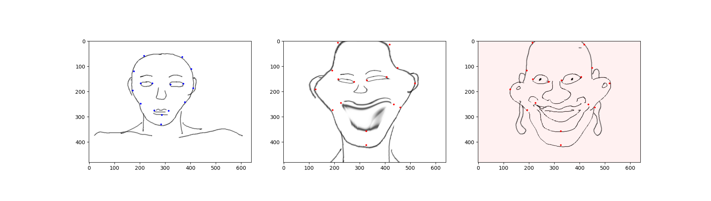

# python-warp-ui



(Due to copyright issues, I put placeholder images in the teaser image. In real usecases, you might want to use a real photo as an input image.)

A simple keypoint-based thin plate spline warping UI.

## Workflow

1. Pick points in an input image
1. Pick points in an reference image in order
1. Save the warped image, forward/backward deformation field, and and the keypoints by pressing 'r'.

## Usage

```
usage: main.py [-h] [-i INPUT] [-r REFERENCE] [-s POINTS_START] [-e POINTS_END] [-o OUTPUT]

optional arguments:
  -h, --help            show this help message and exit
  -i INPUT, --input INPUT
                        input image path
  -r REFERENCE, --reference REFERENCE
                        reference image path
  -s POINTS_START, --points_start POINTS_START
                        input image keypoint .npy file (optional)
  -e POINTS_END, --points_end POINTS_END
                        reference image keypoint .npy file (optional)
  -o OUTPUT, --output OUTPUT
                        output image path (default="out.png")
```

## UI

* Left Figure: Input image
* Middle Figure: Warped image
* Right Figure: Reference image

In any of the left figure and the right figure:

* Left click: add keypoint
* Right click + Drag: move nearest keypoint

After picking more than two points in both the input image and the reference image, press 'r' anytime to save results

The saved files are

1. out.png: warped image
1. out.png.df.forward.npy: forward warping field
1. out.png.df.backward.npy: backward warping field (Used by cv2.remap)
1. out.png.ptrs.start.npy: keypoints in the input image
1. out.png.ptrs.end.npy: keypoints in the reference image
